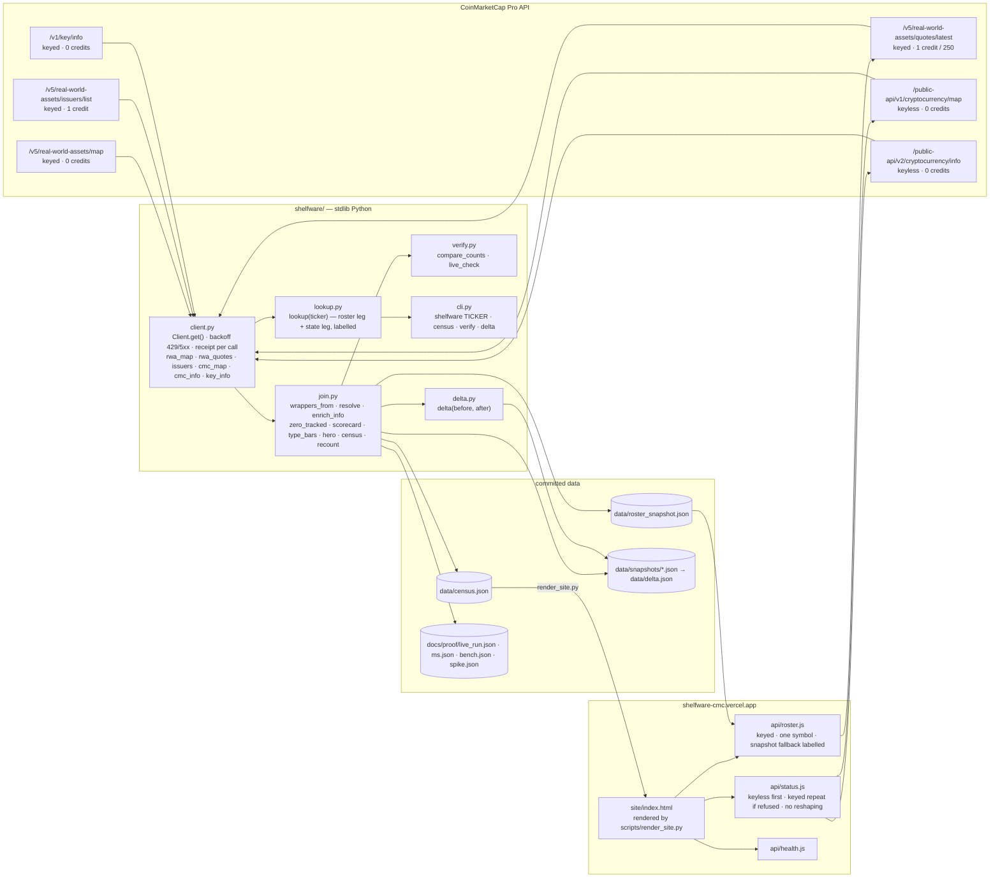

# Architecture

Derived from the code in this repository after it was built, not from a design document. Every
function named below exists in `shelfware/`, `scripts/` or `api/`; every route answers on the
live deployment; the only dependencies are the ones in `pyproject.toml` — none at runtime.

## Shape of the thing

Shelfware is **a join over four ledgers, then counting**. There is no database, no model, no
framework and no server on the judged CLI path; the site is static HTML rendered from a committed
JSON file plus two small serverless functions that let a browser reach an API that sends no CORS
header. Everything that is not the fetch, the join or the count has been left out.



## The engine — `shelfware/` (1,573 lines, stdlib only)

### `client.py` — one GET and the four ledgers

| Function | What it does |
|---|---|
| `Client.get(path, params, keyed, label)` | One HTTP GET. `keyed=False` goes to `/public-api` and **never sends the key, even when one is exported**. `keyed=True` needs a key (`NoKey` otherwise) and goes to the Pro base. Retries 429 / 5xx / dropped connections with 2, 4, 8, 16 s backoff; returns `(json, meta)` where `meta` is the receipt line — URL, HTTP, `credit_count` from CMC's own envelope, bytes, sha256, elapsed, UTC, `error`, `throttled`. Errors are returned, never raised, so a rate limit can never be reported as a fact about a token. |
| `rwa_map()` | Ledger A, paged by `has_more`, 250 per page. |
| `rwa_quotes(rwa_ids=…)` / `rwa_quotes(symbol=…)` | Ledger B in batches of 200 ids with `skip_invalid=true`, or one symbol for the ticker question. Keeps every `tokens[]` entry, `price: null` included. |
| `issuers()` | Ledger C. |
| `cmc_map(symbols=None, keyed=False)` | Ledger D. Full map: 8 pages of 5,000. Per ticker: `symbol=` filter — dotted symbols are never sent (the filter rejects the whole call), an unknown symbol named in a 400 is dropped and the call retried. `keyed=True` is the escape hatch for an IP whose anonymous pool is exhausted; it announces itself in the receipt. |
| `cmc_info(ids, keyed=False)` | Ledger E in batches of 200; ids named in a 400 are dropped and the batch retried. |
| `key_info()` | The month's credit counter, read before and after a census. |
| `credits_used(receipt)` | Σ `credit_count` over **keyed** calls only — the keyless envelope also says 1, charged to nobody. |

### `join.py` — the arithmetic, in full

```
wrappers      = flatten(tokens[] per underlying)                        wrappers_from()
status        = D[crypto_id].status, else "unresolved"                  resolve()
date_added    = E[crypto_id].date_added                                 enrich_info()

shelf(w)                  = w.status == "untracked"                     is_shelf()
zero_tracked(underlying)  = wrappers ≥ 1 and all shelf   (strict)       zero_tracked(strict=True)
                          = no wrapper active           (loose)         zero_tracked(strict=False)
scorecard[issuer]         = declared (C.num_tokens) · attached · tracked · untracked · inactive
                            · unresolved · untracked/attached · Σ market_cap(tracked)   scorecard()
type_bars[asset_type]     = the same over wrappers                      type_bars()
type_underlyings[type]    = the headline split by type                  type_underlyings()
age_tracked               = days since first_historical_data, active    age_of_tracked()
age_shelf                 = days since date_added, untracked            age_of_shelf()
hero                      = min rwa_rank over strict zero-tracked       hero()
census(...)               = all of the above + receipt + counts         census()
recount(doc)              = the counts again, from wrappers[] alone     recount()
```

Nearest-rank percentiles (`pct_rank`) — a p95 is always a real observation.

### `lookup.py` — the ticker question

`lookup(ticker, client, snapshot)` runs two legs and labels each. **Roster:** with a key,
`rwa_quotes(symbol=)` (1 credit; a 400 means the RWA universe has no such symbol — an answer,
not a fallback); without one, or on any other error, `data/roster_snapshot.json` with its date
and the reason. **State:** `cmc_map(symbols)` keyless; wrappers whose symbol the filter rejects
take `active` from `cmc_info`, or the map's finer word from the snapshot when info says
`inactive`; each wrapper carries `status_source` ∈ {`map`, `info`, `info+snapshot`, `snapshot`}.
If the anonymous pool is exhausted and a key is exported, the identical call is repeated keyed
and `status.base = "keyed"`; with no key the committed state is used and `temporary_failure`
is set, which the CLI turns into exit **75**.

### `delta.py`, `verify.py`, `cli.py`

`delta()` diffs two censuses by `crypto_id`: new, gone, flips; `newly_tracked` is strictly
`untracked → active`, `newly_shelved` strictly `active → untracked`, everything else
`other_flips`. `verify.compare_counts()` recounts every headline from the rows and fails on
drift; `live_check()` re-fetches ten states keyless and compares. `cli.main()` dispatches
`TICKER | census | verify | delta`; `run_census()` is the orchestration (A → B → C → D → retry
unresolved by symbol → E → key/info); `write_census()` writes the five artifacts.

## `scripts/` — proof and rendering

| Script | Role |
|---|---|
| `spike.py` | The day-1 question, asked three ways with real calls → `docs/proof/spike.json`. |
| `snapshot.py` | The daily census into `data/snapshots/YYYY-MM-DD.json` + `data/delta.json`; `--import` brings an earlier run into the series, recounted by this engine. Never touches `data/census.json`. |
| `seed.py` | Cuts `data/seed/` — four real responses with provenance — and prints the hero rule and its selection. Not the demo path. |
| `bench.py` | p50/p95 of the state leg, the whole ticker question and the join, separately → `docs/proof/bench.json`. `--replay` is CI only. |
| `verify.py` | `shelfware verify` plus a check that README, DEMO, JUDGE and the page state the pair the rows produce. |
| `render_site.py` | `site/index.html` and `data/health.json` from the census; `--check` fails on drift; an unfilled `{{slot}}` fails the render. |
| `check_submission_readiness.py` | Refuses placeholders, TODOs, overclaims (`never traded`), key-shaped strings in any tracked file, and a census older than three days. |
| `dev_server.mjs` | Serves `site/` and the three functions locally on 8103. |

## `api/` — the proxy (Node, no dependencies)

CoinMarketCap sends no `Access-Control-Allow-Origin`, so a browser cannot call it; one hop is
mechanically required. The functions never reshape CMC's payload — `raw` passes through verbatim.

| Route | Secret | Behaviour |
|---|---|---|
| `GET /api/roster?symbol=` | `CMC_API_KEY` from the Vercel environment — the only place a secret exists | Exactly one symbol matching `^[A-Za-z0-9.$-]{1,16}$`. Live `quotes/latest?symbol=` for 1 credit; a 400 is "no such symbol"; a missing key, 429, 403 or 5xx answers from `data/roster_snapshot.json` with `source: "snapshot"`, its date and the reason. The snapshot tokens ride along on every answer. 60 s cache per symbol per instance. |
| `GET /api/status?symbols=&ids=` | none | 1–20 alphanumeric symbols → `/public-api/v1/cryptocurrency/map`; 1–100 ids → `/public-api/v2/cryptocurrency/info`. Keyless first, always. If the anonymous pool refuses the host's shared IP (429 error 1022, seen on the first production deploy), the identical call is repeated on the keyed base for 1 credit with `base: "keyed"` and the keyless error kept beside it. Failures are never cached. |
| `GET /api/health` | none | Census date, snapshot days, counts, hero, `roster_key_configured` (a boolean is all that is ever said about the key), commit. |

`vercel.json`: `outputDirectory: site`, `includeFiles: data/*.json` for the functions.

## Data files

| File | Written by | Read by |
|---|---|---|
| `data/census.json` | `shelfware census` | `render_site.py`, `verify`, tests, `bench --replay` |
| `data/roster_snapshot.json` | `shelfware census` | `shelfware TICKER` (no key), `api/roster.js` |
| `data/snapshots/*.json`, `data/delta.json` | `shelfware census`, `scripts/snapshot.py` | `render_site.py` (delta panel), `shelfware delta` |
| `data/health.json` | `render_site.py` | `api/health.js` |
| `data/seed/*.json` | `scripts/seed.py` | offline tests, `bench --replay` — **never the demo** |
| `docs/proof/*.json` | the real runs | DEMO.md, the page's hero card (`ms.json`) |

## Failure handling

| Condition | Behaviour |
|---|---|
| HTTP 429 / 5xx / dropped connection | Retried with 2, 4, 8, 16 s backoff; then returned with `throttled: true`. |
| Keyless pool exhausted, key exported | The identical call, keyed; the row says so. |
| Keyless pool exhausted, no key | The committed state, labelled; CLI exits 75 after answering. |
| HTTP 400 from a batched call | The offending symbol / ids named in CMC's message are dropped and the call retried; the rest of the batch survives. |
| Any other 4xx | Returned immediately with CMC's own error code and message — never a raw body. |
| Malformed JSON | An error, never a number. |
| `credits_used` ≠ Σ keyed `credit_count`, or counts ≠ recount | `shelfware verify` exits 1; `make check` fails. |

## Deliberate non-architecture

| Not present | Why |
|---|---|
| Database | The census is a JSON file a judge can `jq`; the series is a directory of dated files. |
| Model / LLM | Every number is a count. There is nothing to infer. |
| Framework | One screen, vanilla HTML/CSS/JS rendered from a template; a build step would add risk for no judge-visible gain. |
| Auth | The CLI's judged path is keyless; the proxy's one secret lives in the deployment environment and is never in the repo, the browser, a log or a receipt. |
| Runtime dependencies | `python3 -m shelfware MS` works on a clean machine with no install step. |
