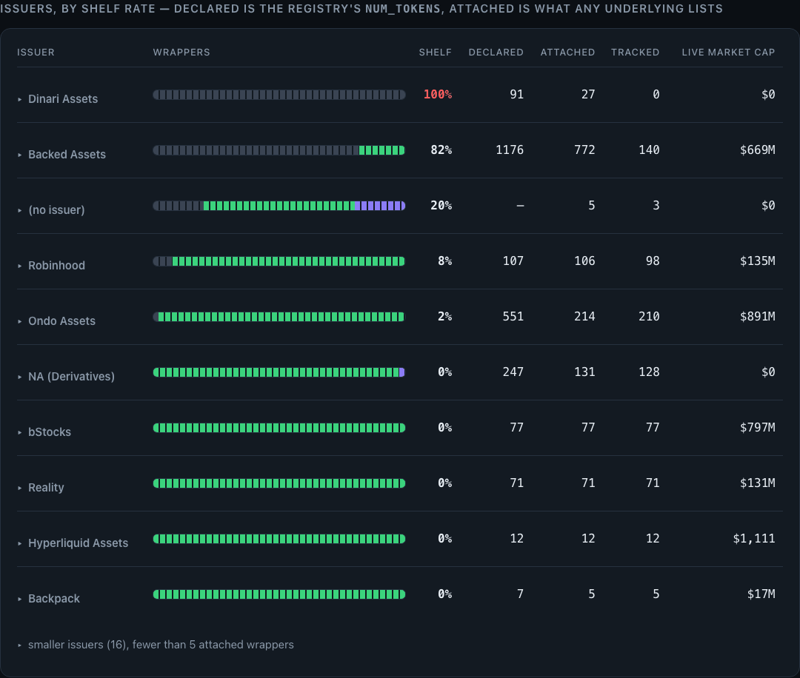
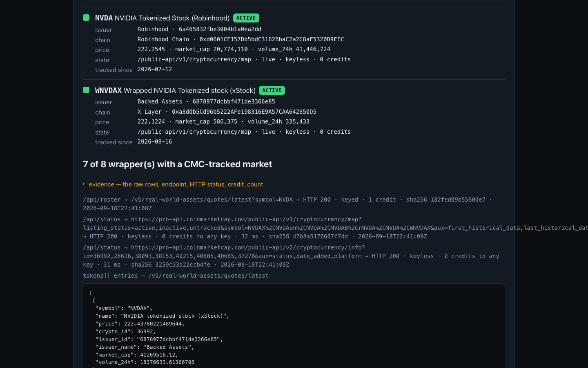
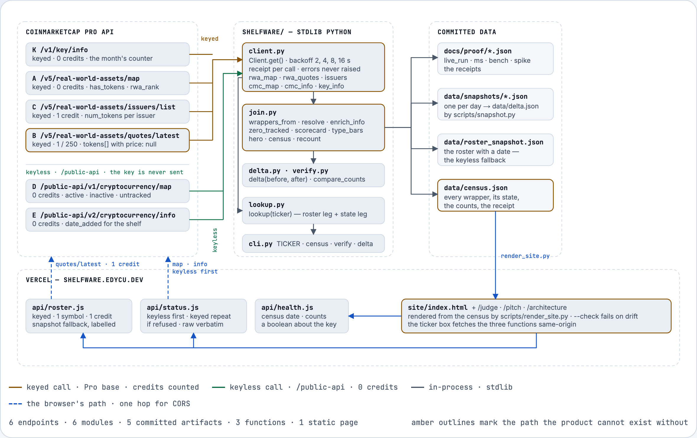
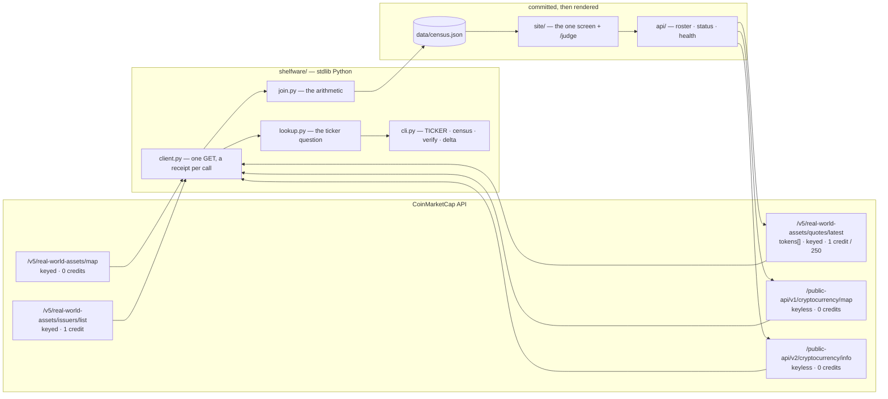

<div align="center">


<h1>Shelfware 📦</h1>

<p><em>Six in ten tokenised stocks on CoinMarketCap have no wrapper with a tracked market.</em></p>



<p>CoinMarketCap's RWA surface answers <strong>"is this asset tokenised?"</strong> with a boolean.
Shelfware answers the question an allocator asks before acting — <strong>does any wrapper of it
have a market, and whose?</strong> — by joining the wrapper roster, <code>price: null</code> rows
included, to each wrapper's listing state.</p>

<p><strong>Live, 2026-09-18T22:16Z, 5 keyed credits, 40.9 s:</strong> of the 791 underlyings
CoinMarketCap flags <code>has_tokens: true</code>, <strong>476 of 791 (60%) have no wrapper with a
CMC-tracked market.</strong> The ticker question is keyless:
<code>python3 -m shelfware MS</code>. <a href="DEMO.md">Receipt →</a></p>

<br/>

[](https://shelfware.edycu.dev/judge)
[](https://shelfware.edycu.dev)
[](https://shelfware.edycu.dev/pitch/)
[](FEEDBACK.md)
[](https://dorahacks.io/hackathon/coinmarketcap-api-202609/detail)

<br/>


[](https://github.com/edycutjong/shelfware/actions/workflows/ci.yml)
[](https://github.com/edycutjong/shelfware/releases/latest)
[](LICENSE)

</div>

---

## 📸 See it in Action

<div align="center">
  
</div>

> **Type a ticker → every wrapper, its issuer, its chain, its listing state → the raw API rows
> that prove it.** Then the issuer table: the same pair, 772 times in Backed Assets' row.

No key. No signup. No install. One command:

```bash
git clone https://github.com/edycutjong/shelfware.git && cd shelfware
python3 -m shelfware MS
```

```
shelfware MS — does it have a wrapper that trades, and whose?

  MS  Morgan Stanley · stock · rwa_rank 43 · has_tokens: true
      roster: snapshot 2026-09-18T22:16:17Z (the RWA endpoints need a key; export CMC_API_KEY to go live)
      ▒ wMSx  Wrapped Morgan Stanley Tokenized Stock (xStock)
          issuer   Backed Assets  6878977dcbbf471de3366e85
          chain    X Layer  0x2874A11805783324C54562eDB1A641C5d1d077a5
          price    null · market_cap null · volume_24h null
          status   UNTRACKED      ← /public-api/v1/cryptocurrency/map, live, keyless, 0 credits
                   "listed, no CMC-tracked market" — CMC: registered cryptocurrency projects that are listed but do not yet meet methodology requirements to have tracked markets
                   listed 2026-08-11 (date_added) · 38 days on the shelf

  0 of 1 wrapper(s) with a CMC-tracked market

receipt: cmc/map symbol=wMSx → HTTP 200 · keyless · 0 credits to any key · 491 ms · sha256 d7e1ecdef293e6c8  |  cmc/info batch 1 (1 ids) → HTTP 200 · keyless · 0 credits to any key · 762 ms · sha256 1559b2c185ccabe8
```

> **That is a live call.** The listing state comes from CoinMarketCap's keyless `/public-api`
> surface at the moment you run it; the receipt line carries the endpoint, the HTTP status, the
> credit count and the sha256 of the body. Run it yourself and the timings will differ. The raw
> rows are committed at [`docs/proof/ms.json`](docs/proof/ms.json) and walked through in
> **[DEMO.md](DEMO.md)**.

**MS is a rule, not a pick** — the most prominent tokenised underlying on CoinMarketCap (lowest
`rwa_rank`) whose every wrapper is untracked. Next in line: APH (80), GILD (83), WELL (94). If
its wrapper comes alive tomorrow, the rule moves to APH and the delta panel shows the flip.

<div align="center">
  
</div>

The one screen, live: **[shelfware.edycu.dev](https://shelfware.edycu.dev)** — the
number, the issuer scorecard, the asset-type bars, the day-over-day delta, and the same ticker
question through the site's proxy with the raw API rows in an evidence drawer beside every answer.

---

## 💡 The Problem & Solution

### The Problem

An issuer's press release says "700+ tokenised stocks". CoinMarketCap's RWA page says Morgan
Stanley is tokenised. Both are true — and neither says whether anyone can trade it.

The two facts live in two API families that nobody joins:

| | Where it lives | What it says |
|---|---|---|
| "MS is tokenised" | `/v5/real-world-assets/map` → `has_tokens: true` | a wrapper exists |
| "the wrapper has no market" | `/v1/cryptocurrency/map` → `status: untracked` | *listed, no CMC-tracked market* — CoinMarketCap's own definition |

Every price-based RWA tool filters out the `price: null` rows before it starts, so the shelf is
invisible by construction. Nothing on the RWA page distinguishes **MS** (one wrapper, untracked)
from **NVDA** (eight wrappers, seven trading).

### The Solution

**Shelfware counts the wrappers that are on the shelf.** It enumerates every tokenised
underlying, pulls the full wrapper roster *including* the null-price rows, joins each wrapper to
its listing state on the cryptocurrency map, and reports what the boolean hides.

| | Live, 2026-09-18T22:16Z |
|---|---|
| **The number** | **476 of 791** tokenised underlyings (60%) have no wrapper with a CMC-tracked market; stocks alone 437 of 689 (63%) |
| The wrappers | 673 of 1,435 (47%) are untracked; 603 of those sit on one chain, X Layer, all Backed Assets |
| The issuers | Dinari 27 / 27 on the shelf · Backed Assets 632 / 772 (82%, $669M live in the rest) · Robinhood 8 / 106 · Ondo 4 / 214 · bStocks 0 / 77 |
| The exactness | `price == null ⇔ status == "untracked"` held with **0 exceptions across 1,431 resolved wrappers** — the join is a count, not a heuristic |

**Key features:**

- 🔎 **Ticker search** — `MS` → every wrapper, issuer, chain, `token_address`, listing state and
  listing date, with the raw `tokens[]` entry, map row and info row in an evidence drawer. Live.
- 📋 **Issuer scorecard** — declared catalogue · attached wrappers · tracked wrappers · shelf rate,
  beside the live market cap of what does trade.
- 📊 **Asset-type bars** — stock 49% shelf (606 / 1,244 wrappers) · ETF 38% · commodity 0%.
- 📅 **Delta panel** — newly tracked / newly shelved / new / gone since the previous daily snapshot
  (series started 2026-09-18, four days so far; day 4: +0 / +0 / +0 / −0, a real zero on the live page).
- 🧾 **A receipt on every number** — endpoint, HTTP status, `credit_count`, bytes, sha256, UTC —
  and two `jq` filters that re-derive both headlines from the committed rows.

---

## 🏗️ Architecture & Tech Stack

```
four ledgers (3 keyed, 1 keyless)  →  one join on crypto_id  →  three counting rules  →  a receipt beside every number
```

<picture>
  <source media="(prefers-color-scheme: dark)" srcset="docs/assets/architecture-dark.png">
  
</picture>

<p align="center"><sub>The same diagram as a page, light and dark, with the derivation beside it: <a href="https://shelfware.edycu.dev/architecture/">shelfware.edycu.dev/architecture/</a></sub></p>

<details>
<summary><b>Architecture diagram as Mermaid</b> (click to expand)</summary>



</details>

No database, no model, no framework, no server on the judged path. The site is static HTML
rendered from the committed census plus two dependency-free serverless functions that let a
browser reach an API that sends no CORS header.

| Stage | Where | What it does |
|---|---|---|
| Fetch | [`client.py`](shelfware/client.py) | One GET. Keyless by default (`/public-api`, never sends a key); `keyed=True` goes to the Pro base. Backs off on 429/5xx (2, 4, 8, 16 s); returns errors in the meta instead of raising; records endpoint, HTTP, `credit_count`, bytes, sha256, UTC per call. |
| **Join** | [`join.py`](shelfware/join.py) | **The product.** `tokens[]` → wrappers; each `crypto_id` → its map row across `active,inactive,untracked`; unresolved ids get their own bucket. Then the three counting rules, the issuer scorecard, the type bars, the hero rule. |
| Ask | [`lookup.py`](shelfware/lookup.py) | The ticker question: roster leg (keyed, snapshot fallback labelled with its date) + state leg (keyless, live), each row naming its source. |
| Diff | [`delta.py`](shelfware/delta.py) | Two snapshots → newly tracked, newly shelved, new, gone. |
| Recount | [`verify.py`](shelfware/verify.py) | Every headline recounted from the rows; drift on README, DEMO, JUDGE or the page fails. |

| Layer | Technology |
|---|---|
| Engine | Python 3.11, **stdlib only** — `python3 -m shelfware MS` needs no `pip install` |
| Data | CoinMarketCap RWA family (keyed, Basic tier) + the keyless `/public-api` cryptocurrency surface |
| Site | Static HTML rendered by `scripts/render_site.py` (landing, `/judge`, `/pitch`); served by Vercel at shelfware.edycu.dev (and under its default name, shelfware-cmc.vercel.app); Vercel functions in dependency-free Node with open CORS |
| Tests | pytest · **hypothesis** (property-based) · live contract tests · `node --test` for the functions |
| Quality | ruff · mypy · pytest-cov (engine gated at 100%) · pip-audit · gitleaks · CodeQL · Dependabot |

Full derivation from the code, every failure mode, and the deliberate non-architecture:
**[ARCHITECTURE.md](ARCHITECTURE.md)** — rendered as a page, light or dark:
[shelfware.edycu.dev/architecture](https://shelfware.edycu.dev/architecture/).
The rules and their invariants: [docs/METHOD.md](docs/METHOD.md).

---

## 🏆 CoinMarketCap Integration

| Endpoint | Used for | Key | Credits | Called from |
|---|---|---|---|---|
| `/v5/real-world-assets/map` | the universe: every underlying, `has_tokens`, `rwa_rank`, `asset_type` | 🔑 | 0 | [`client.rwa_map`](shelfware/client.py) |
| `/v5/real-world-assets/quotes/latest` | `tokens[]` — the wrapper roster **including the `price: null` rows** the RWA pages hide; `issuer_id`, `crypto_id` per wrapper | 🔑 | 1 / 250 assets | [`client.rwa_quotes`](shelfware/client.py) · [`api/roster.js`](api/roster.js) |
| `/v5/real-world-assets/issuers/list` | the issuer registry with its declared `num_tokens` | 🔑 | 1 | [`client.issuers`](shelfware/client.py) |
| `/public-api/v1/cryptocurrency/map` | listing state per wrapper across `active,inactive,untracked`, birth date, chain — **the engine's other half** | 🔓 none | 0 | [`client.cmc_map`](shelfware/client.py) · [`api/status.js`](api/status.js) |
| `/public-api/v2/cryptocurrency/info` | `date_added` — the day a shelf wrapper was listed; state for the 38 dotted symbols the map filter rejects | 🔓 none | 0 | [`client.cmc_info`](shelfware/client.py) · [`api/status.js`](api/status.js) |
| `/v1/key/info` | the credit ledger before and after a census — so the receipt's credit count is CoinMarketCap's, not ours | 🔑 | 0 | [`client.key_info`](shelfware/client.py) |
| `/v5/real-world-assets/market-pairs/list` | **not used** — documented as Basic, returns 403 error 1006 on the Startup plan. Tried, recorded, not built on ([FEEDBACK.md §3](FEEDBACK.md)) | — | — | *nothing* |

Every keyed call is Basic-tier, and the whole census costs **5 credits**. The keyless half costs
nothing to anyone: the envelope says `credit_count: 1` and charges it to no key.

```bash
make demo      # /public-api/v1/cryptocurrency/map + /v2/cryptocurrency/info  -> the ticker question, no key
make census    # all six endpoints -> data/census.json + docs/proof/live_run.json, ~5 credits, ~40 s
```

### Why only CoinMarketCap

The wrapper roster with its null-price rows exists in exactly one place: `tokens[]` on
`/v5/real-world-assets/quotes/latest`. The listing state that explains the nulls exists in exactly
one place: `status` on `/v1/cryptocurrency/map`. The universe those two are joined over —
7,811 underlyings with a `has_tokens` flag and a rank — is `/v5/real-world-assets/map`, and the
day a shelf wrapper was listed is `date_added` on `/v2/cryptocurrency/info`.

No single endpoint says a wrapper has no market: the RWA quotes say `price: null`, the map says
`untracked`, and only the join over `issuer_id` turns that into an issuer scorecard. **Delete
CoinMarketCap and both ledgers vanish.** Recovering them would take an issuer-by-issuer catalogue
crawl (Backed, Dinari, Ondo, Robinhood, bStocks, twenty more), a per-venue market census across
every chain those wrappers sit on, and a registry to reconcile the two — three systems to
recompute what two calls return, and none of them would carry CoinMarketCap's definition of the
word the whole count rests on.

### Where the API got in the way

Twelve dated, evidenced findings are written up for the CMC team in **[FEEDBACK.md](FEEDBACK.md)**,
and each one changed something in this code. The RWA-family ones, in one screen:

1. **A `tokens[]` row carries neither the wrapper's listing state nor its chain** — eight fields
   (`crypto_id`, `symbol`, `name`, `issuer_id`, `issuer_name`, `price`, `market_cap`,
   `volume_24h`); the *why* of a null price and the `platform` live only on the map row. The
   product exists because of that gap ([#1](FEEDBACK.md)).
2. **`price == null ⇔ status == "untracked"`, 0 exceptions in 1,431 resolved wrappers** — the null
   is a listing state, not a data hole, and nothing on the RWA endpoints documents it (#1, #7).
3. **The RWA family is keyed; the cryptocurrency map is keyless** — one question on two plan
   tiers, 403 error 1005 keyless (#2).
4. **`market-pairs/list` is documented as Basic and returns 403 error 1006 on Startup** — tried,
   recorded, not built on (#3).
5. **The map's `symbol` filter rejects symbols CoinMarketCap itself assigns** — `NVDA.D`,
   `AI.FRx`, 38 wrappers — and one bad symbol fails the whole batched call (#4, #5).
6. **Untracked map rows carry no dates**; the listing day is on `/v2/cryptocurrency/info`, whose
   `status` vocabulary is coarser (#7, #8).
7. **`tokens[]` references 4 ids that exist on no public surface** — shown, never counted (#9).
8. **`num_tokens` on the issuer registry is undocumented and over-declares what is attached** —
   Backed 1,176 declared vs 772 in `tokens[]`, Dinari 91 vs 27 (#11).
9. **The anonymous tier is per IP, a shared cloud egress exhausts it for good, and the envelope
   hides it** — two undocumented 429 codes, no `Retry-After` (#10).

---

## 📊 Engineering Rigor

| Measurement | Value |
|---|---|
| Live census wall clock | **40.9 s** — 54 calls, cold start to final line ([`live_run.json`](docs/proof/live_run.json)) |
| **Keyed credits** | **5** — `/v1/key/info` read 12,020 → 12,025 before and after, equal to Σ `credit_count` over the 39 keyed calls |
| Keyless calls | 15 — charged to no key |
| Tests | **262** — 245 offline (~1 s), 11 for the proxy functions, 6 live |
| Regression tests named for the defect they pin, each seen against the live API on 2026-09-18 | 9 |
| **Property-based verification of the join** | **500 generated ledgers, 0 failing** — six invariants |
| Engine coverage | 100% statements + branches of `shelfware/` and `scripts/`, gated at 100% in CI |
| Ticker question, keyless | p50 **552 ms** · p95 603 ms (n=9) — [`bench.json`](docs/proof/bench.json) |
| State leg alone, one keyless map call | p50 **282 ms** · p95 546 ms (n=9) |
| Join + count over the 1,435 committed wrappers | p50 **1.94 ms** · p95 2.22 ms (n=200) |

**The 500 is the number worth reading.** Coverage says the lines ran. The property test says
that across 500 generated ledgers the counting rules never violated `strict ≤ loose ≤
has_tokens`, the issuer and type tables never summed to anything but the wrapper count, the
counts block always equalled a recount from the rows, and an unresolved id was never counted as
shelf. `pytest tests/test_property.py -q` reproduces it.

That n=9 is not a typo: the tenth ticker hit the anonymous tier's per-IP burst limit (`429 error
1011`) after ~20 keyless calls in 15 seconds, and the bench reports it under `errors` rather than
smoothing it away. A judge typing tickers by hand never approaches it.

### The three counting rules

| Rule | Definition | Direction |
|---|---|---|
| shelf | `status == "untracked"` — CoinMarketCap's own word, not `price is None` | the two coincide today with 0 exceptions in 1,431 resolved wrappers |
| zero-tracked underlying *(the headline)* | **every** attached wrapper untracked | an unresolved or inactive wrapper blocks the count; the loose rule is shown beside it and never headlined |
| shelf rate per issuer | untracked ÷ attached, beside the live market cap of what trades | `declared` (registry `num_tokens`) and `attached` are two ledgers; neither substitutes for the other |

Re-derive by hand: `jq '.wrappers | group_by(.rwa_id) | map(select(all(.[]; .status=="untracked"))) | length' data/census.json` → 476.

### Attacks defeated

| Control | Why it is load-bearing | Test |
|---|---|---|
| An unresolved wrapper id is shown, never counted as shelf | 4 ids in `tokens[]` exist on no public surface; counting them would inflate the headline | [`test_join.py:47`](tests/test_join.py#L47) |
| The strict rule can never exceed the loose one | the headline takes the conservative count; if it were ever larger, the rule was misapplied | [`test_join.py:67`](tests/test_join.py#L67) |
| `price == null ⇔ untracked` on the committed census | the day CoinMarketCap prices an untracked wrapper, the join stops being exact and this says so | [`test_join.py:232`](tests/test_join.py#L232) |
| A dotted symbol is never sent to the map filter | `NVDA.D` 400s the *whole* call; 38 wrappers would have taken their neighbours down with them | [`test_client.py:140`](tests/test_client.py#L140) |
| An unknown symbol or id is dropped and the batch retried once | one bad name 400s a 200-id batch; the census needs the other 199 | [`test_client.py:150`](tests/test_client.py#L150) · [`:179`](tests/test_client.py#L179) |
| An exhausted throttle is returned, never raised; the CLI exits 75 | a shared cloud egress IP is refused outright (429 error 1022); a script must tell a throttle from a failure | [`test_client.py:75`](tests/test_client.py#L75) · [`test_cli.py:70`](tests/test_cli.py#L70) |
| The census refuses to run without a key rather than replaying | the judged capability must never silently become a fixture | [`test_cli.py:37`](tests/test_cli.py#L37) |
| A keyless call never carries the key, even when one is exported | "0 credits to any key" is a claim about the request, so it is tested on the request | [`test_client.py:25`](tests/test_client.py#L25) |
| With a key exported, the run says so and the key reaches no output | a keyed run can never pass as keyless; the key can never pass into a receipt | [`test_permission_boundary.py:23`](tests/test_permission_boundary.py#L23) |
| A key-shaped string in any tracked file fails the readiness gate | the one secret this project could leak has one shape | [`test_readiness.py:26`](tests/test_readiness.py#L26) |
| The wording overclaim fails the readiness gate on every judge-facing file | `untracked` means *listed, no CMC-tracked market*; the gate refuses anything stronger | [`test_readiness.py:18`](tests/test_readiness.py#L18) |
| The landing page and `/judge` are what their inputs render, byte for byte | no number a judge reads can be typed in by hand or drift from its census | [`test_render_site.py:41`](tests/test_render_site.py#L41) · [`test_judge_route.py:31`](tests/test_judge_route.py#L31) |
| The stated test count is the suite size, on every surface | three hand-typed copies of one number drifted by seven the first time the suite grew | [`test_published_counts.py:32`](tests/test_published_counts.py#L32) |

### Honest limits (7)

1. **"untracked" is CoinMarketCap's listing state, not a claim about the world** — *listed, no
   CMC-tracked market*. Dinari's dShares trade on Dinari's own permissioned venue; a pool CMC does
   not index is still a pool. The number is about CMC's coverage of what CMC calls tokenised,
   which is exactly why it can be re-derived from CMC's rows.
2. **The roster leg needs a key.** The RWA family is keyed (keyless → 403 error 1005). Without one
   it is a dated snapshot, labelled on the row; the state leg is live regardless.
3. **The map's symbol filter rejects CoinMarketCap's own dotted symbols** (`NVDA.D`, `AI.FRx` —
   38 wrappers, HTTP 400 for the whole call). Those rows take their live state from
   `/v2/cryptocurrency/info`, whose vocabulary is coarser, and the map's finer word from the
   committed snapshot; each row names both sources.
4. **The census is a daily series, not a history.** Untracked rows carry no dates; `date_added`
   is a listing day, not a market day. The series started 2026-09-18 and has four days.
5. **The anonymous tier is per IP.** A shared cloud egress can be refused outright (429 error
   1022); the CLI backs off, repeats the identical call keyed if a key is exported and says so,
   and otherwise answers from the snapshot and exits 75 (`EX_TEMPFAIL`).
6. **4 wrapper ids resolve nowhere** (39318, 39002, 39839, 42326 — null symbols in `tokens[]`,
   unknown to both the map and the info endpoint). Shown, never counted.
7. **Retracted, 2026-09-18.** The first draft headlined the shelf wrappers as "never traded" — the spike settled that 'never traded' would be false: `untracked` is a listing state, Dinari trades off-CMC, and the honest word is CoinMarketCap's. Every surface was re-worded and the readiness gate now refuses the stronger claim ([`docs/proof/spike.json`](docs/proof/spike.json)).

---

## 🚀 Getting Started

### Prerequisites

- Python 3.11 or newer. That is the entire list.
- **No API key, no account, no `pip install`.** The `shelfware/` package is stdlib-only.

### Installation

```bash
git clone https://github.com/edycutjong/shelfware.git
cd shelfware
python3 -m shelfware MS        # the hero ticker — state leg live, keyless
python3 -m shelfware NVDA      # a mixed one: 7 of 8 wrappers tracked
python3 -m shelfware verify    # recount every headline from data/census.json
```

> **For judges:** there is no account to create and no credential to configure. Start at
> **[shelfware.edycu.dev/judge](https://shelfware.edycu.dev/judge)** — the claim, the
> 30-second path, the receipt — or its source, [JUDGE.md](JUDGE.md). Try `GILD`, `IBIT`, `PLD`
> for more shelf; `GOLD` for a commodity that trades; `MSFT` for eight wrappers where one is on
> the shelf.

### With a free key — the roster goes live, and the census runs

```bash
export CMC_API_KEY=...        # a free Basic key from coinmarketcap.com/api; never committed, never required
python3 -m shelfware MS       # the roster leg goes live (1 credit); the state leg was live already
python3 -m shelfware census   # 7,811 underlyings → 1,435 wrappers → the count, ~5 credits, ~40 s
```

The key is read from the environment at call time, never from a file. A keyed run says so on the
roster line and in its receipt, so it can never pass as a keyless one.

---

## 🧪 Testing & CI

```bash
make setup           # dev deps only: pytest, pytest-cov, ruff, mypy, hypothesis, pip-audit
make lint            # ruff check + format check
make typecheck       # mypy over the engine, the scripts and the tests
make test            # 245 offline tests, ~1 s, no internet
make test-coverage   # the same, with shelfware/ and scripts/ gated at 100%
make test-api        # the three Vercel functions, in-process with a stubbed fetch
make test-live       # 6 tests against the real CoinMarketCap contract and the deployed /judge route
make demo            # the judged capability, live, no key
make bench           # p50/p95 of the live keyless state leg and of the join, timed apart
make check           # refuse to ship a placeholder, a key, or a page that drifted from its census
make ci              # lint + typecheck + coverage + api tests + audit + check
```

| Layer | Tool | Status |
|---|---|---|
| Code quality | ruff (check + format) · mypy | ✅ |
| Unit testing | pytest, 245 offline tests, engine coverage gated at 100% | ✅ |
| Property testing | hypothesis, 500 generated ledgers | ✅ |
| Live contract testing | pytest `-m live` against the real API and the deployed `/judge` | ✅ |
| Proxy functions | `node --test`, 11 tests with a stubbed fetch | ✅ |
| Security (SAST) | CodeQL — Python and JavaScript, weekly + on PRs | ✅ |
| Security (SCA) | Dependabot alerts + monthly grouped updates · pip-audit | ✅ |
| Secret scanning | gitleaks over the full history, with a rule for the CMC key shape | ✅ |
| Release automation | semver from conventional commits — `release.yml` stamps the version into the tree, re-renders, commits, tags, publishes | ✅ |
| Deploy automation | `vercel build` + `vercel deploy --prebuilt --prod` from CI, main only, after every gate and the release | ✅ |

CI runs seven jobs on every push: lint + typecheck, the test matrix on Python 3.11 / 3.12 / 3.13,
the node proxy tests, `pip-audit`, the no-placeholder / no-drift gate, the deterministic replay
bench — **and a `live-api` job that asks the ticker question against the real CoinMarketCap API
with no credentials.** It is keyless, so it runs on forks and PRs too; if CMC changes the
contract, it breaks in CI rather than in front of a judge. A throttled shared runner IP (exit 75)
is a warning, every other non-zero exit is red. On `main` only, three more stages follow the
seven: a **deploy gate** (one required check), the **release** (`feat` → minor, `fix`/`perf` →
patch, `!` → major, computed from the commits since the last tag; when there is one, the version
is written into `pyproject.toml` / `__version__` / `api/health.js` by `scripts/bump_version.py`,
the site re-rendered, the result committed as `chore(release): vX.Y.Z`, tagged and published — a
chore- or data-only push mints nothing) and the **production deploy** of that commit to Vercel.

**The page, the judge route and the health file are generated, never hand-edited.**
`scripts/render_site.py` renders `site/index.html`, `site/judge/index.html` and
`data/health.json` from the committed census and `JUDGE.md`; every figure is a `{{slot}}` filled
from a committed JSON receipt, the render aborts on an unfilled slot, and CI fails on any diff
between the render and what is committed. `scripts/verify.py` then recounts the headline from the
rows on README, DEMO, JUDGE and the page, and `tests/test_published_counts.py` holds the stated
test count to the suite. So no number a judge reads can be typed in by hand, and none can drift
from the run that produced it.

---

## 📁 Project Structure

```
shelfware/
├── shelfware/                    the engine — stdlib only
│   ├── client.py                 one GET, four ledgers, a receipt per call, backoff, no raising
│   ├── join.py                   the arithmetic: wrappers, resolve, three counting rules, scorecard, hero rule
│   ├── lookup.py                 the ticker question — roster leg + state leg, each row labelled
│   ├── delta.py · verify.py      two snapshots diffed · every headline recounted from the rows
│   └── cli.py                    shelfware TICKER · census · verify · delta
├── api/                          Vercel functions, no dependencies: roster (keyed) · status (keyless first) · health
├── site/                         generated: the one screen (/), the judge page (/judge) and the deck (/pitch)
├── scripts/                      snapshot · seed · bench · verify · render_site · md2html · readiness gate · spike
├── data/                         census.json · roster_snapshot.json · snapshots/ · delta.json · seed/
├── docs/proof/                   live_run.json · ms.json · bench.json · spike.json — the receipts
├── docs/                         METHOD.md · COMPARISON.md · screenshots/ · assets/
├── tests/                        245 offline · 6 live · api.test.mjs
├── JUDGE.md · DEMO.md · ARCHITECTURE.md · FEEDBACK.md
└── README.md                     you are here
```

---

## 🗺️ Roadmap

- [x] The three-endpoint join, live: 476 of 791 on 2026-09-18, 5 credits, 40.9 s
- [x] The ticker question keyless — state leg live, roster snapshot labelled, key optional
- [x] The one screen with the evidence drawer, the issuer scorecard and the type bars
- [x] A daily snapshot series and the delta panel (four days so far, +0 / +0 / +0 / −0)
- [x] Receipts, benchmarks, a property test over 500 ledgers, and a gate that recounts every headline
- [x] `/judge` — the claim, the 30-second path and the receipt on one page, no auth
- [x] `/pitch` — the twelve-slide deck, rendered from the census, drift-gated like the page
- [x] Twelve dated findings for the CoinMarketCap team, filed in [FEEDBACK.md](FEEDBACK.md)
- [ ] A week of snapshots → the first *weekly* delta ("what changed this week") on the page
- [x] A demo video, recorded from the live site and the CLI — https://youtu.be/6DTtNmWAv5g
- [ ] Re-verify every keyed call on a Basic-tier key after 1 October, when hackathon keys revert

---

## 📽️ Demo Materials

| | |
|---|---|
| **Live** | **[shelfware.edycu.dev](https://shelfware.edycu.dev)** — the census with its receipt, the issuer scorecard, and the ticker question through the site's proxy |
| **Demo video** | **[https://youtu.be/6DTtNmWAv5g](https://youtu.be/6DTtNmWAv5g)** — 2 min 51 s, real product only, real time: the census page, a real keyless ticker question through the site's proxy, the CLI from a fresh clone, the keyed census, the issuer scorecard and the receipt; subtitles in the upload |
| **For judges** | **[shelfware.edycu.dev/judge](https://shelfware.edycu.dev/judge)** — the 30-second path; source in [JUDGE.md](JUDGE.md) |
| **Pitch deck** | **[shelfware.edycu.dev/pitch](https://shelfware.edycu.dev/pitch/)** — 12 slides, arrow keys, `P` for speaker notes, `Cmd+P` for a PDF; rendered from the census by `scripts/render_site.py`, so every number on it is the receipt's. Source: [`scripts/site_templates/pitch.html`](scripts/site_templates/pitch.html) |
| **Also at** | **[shelfware-cmc.vercel.app](https://shelfware-cmc.vercel.app)** — the same deployment under the project's default Vercel name (the address the 2026-09-20 demo takes were recorded against). `shelfware.edycu.dev` is the canonical host, a production domain on the same project since 2026-09-20, so the ticker search is same-origin on both. One host, one deployment — there is no GitHub Pages mirror |
| **The receipt** | **[DEMO.md](DEMO.md)** — both live runs transcribed, with [`docs/proof/live_run.json`](docs/proof/live_run.json) and [`ms.json`](docs/proof/ms.json) behind them |
| **Health** | [shelfware.edycu.dev/api/health](https://shelfware.edycu.dev/api/health) — census date, snapshot days, the counts, the deployed commit; a boolean about the key, never the key |
| **Screenshots** | [docs/screenshots/](docs/screenshots/) — eight captures of live execution: the MS card, the NVDA answer with its evidence drawer, the issuer scorecard, the census receipt, the delta panel, the type bars, the limits card, the whole page |
| **The field** | [docs/COMPARISON.md](docs/COMPARISON.md) — the six closest entries by name, what each counts, and what each filters out |

---

## 📄 License

MIT — see [LICENSE](LICENSE).

---

## 🙏 Acknowledgments

Built by Edy Cu for the **[Build with CMC: API Hackathon](https://dorahacks.io/hackathon/coinmarketcap-api-202609/detail)**,
**Real World Assets** track. Thank you to the CoinMarketCap team for exposing the `price: null`
rows in `tokens[]` and the listing state on a keyless endpoint — that pair is the whole product —
and for the RWA family that made the census a five-credit question. Our feedback on the rest of
the API is in [FEEDBACK.md](FEEDBACK.md).
